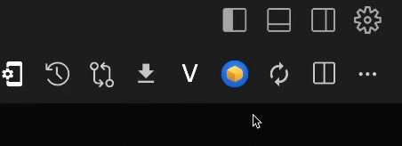
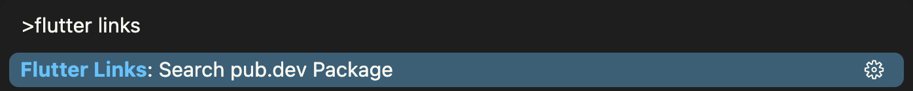

# Flutter Pubspec Links

<p align="center">
  
</p>

<p align="center">
  <a href="https://marketplace.visualstudio.com/items?itemName=djbkwon.flutter-dependency-docs" target="_blank">
    
  </a>
  <a href="https://marketplace.visualstudio.com/items?itemName=djbkwon.flutter-dependency-docs" target="_blank">
    
  </a>
  <a href="./LICENSE.txt" target="_blank">
    
  </a>
</p>

## What does this do?

*   **Display pub.dev links:** Displays a clickable `pub.dev/packages/...` link directly above each dependency listed in your `pubspec.yaml` file.


*   **Toggle Display:** Show or hide the  links using a convenient toggle button in the editor's title bar when viewing `pubspec.yaml`.



### This  can also...

*   **Manual Package Search:** Quickly search for *any* package on pub.dev via the Command Palette.

*   **Configurable Base URL:** Optionally change the base URL used for links via VS Code settings (useful for private package repositories that mimic the pub.dev API structure). 
      *   **Default:** `"https://pub.dev/"`
      *   **Example:** `"https://my-private-repo.com/api/"` (Ensure your repo structure matches `/packages/<name>`)

      * Configure this in your User or Workspace `settings.json` (Command Palette: `Preferences: Open Settings (JSON)`):
        ```json
        {
          "flutterLinks.baseUrl": "https://pub.dev/"
        }
        ```

## Credits

*This extension is an upgraded & maintained version of [Pubspec Dependency Search](https://marketplace.visualstudio.com/items?itemName=everettjf.pubspec-dependency-search).*

*   Developed by [Joonbeom Kwon](https://github.com/danieljbk).
*   Initial code by [Everettjf](https://github.com/everettjf).
